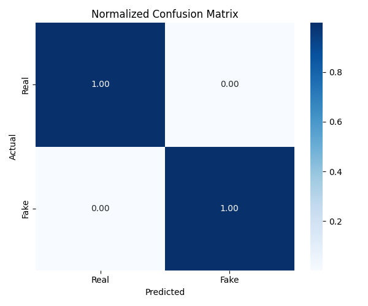
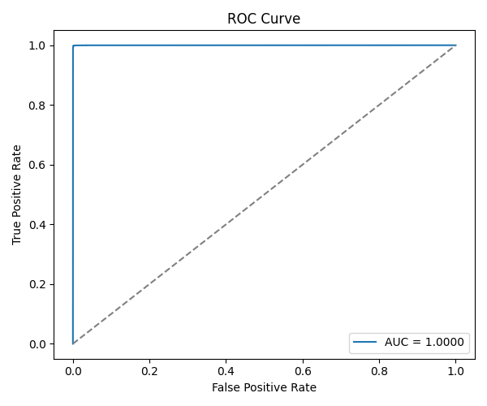
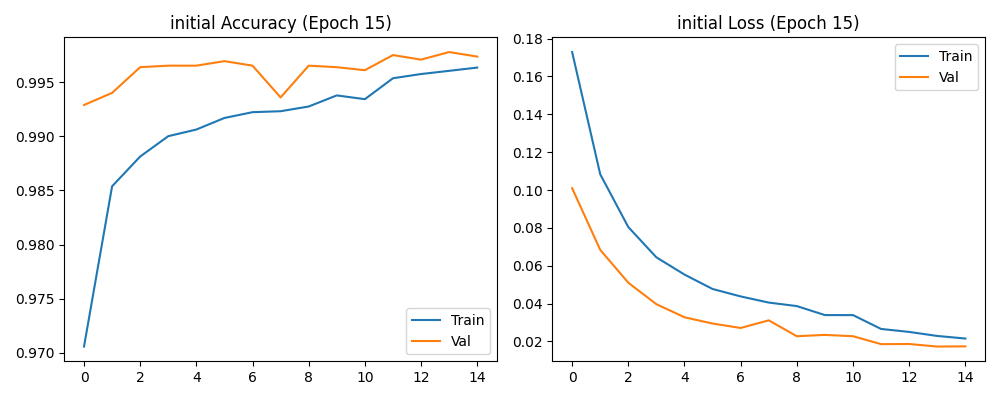
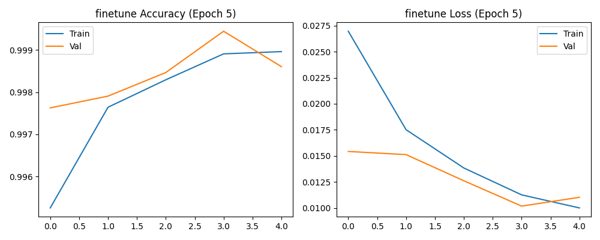

🧠 Deepfake Image Detection — End-to-End Project
Because truth matters — detecting what isn’t real.

This project is an end-to-end Deep Learning system for detecting Real vs Fake facial images using a Hybrid CNN + ResNet50 architecture.
I built everything from scratch — including dataset collection, preprocessing, model design, GPU training, evaluation, visualization, and deployment UI.

It’s not perfect — and that’s intentional.
This project reflects my research honesty, hands-on learning, experiments, failures, and improvement journey.

🚀 Features

    🧠 Hybrid CNN-ResNet50 Deepfake Classifier

    📦 ~141,000 Real & Fake face images (50-50 balance)

    ⚙️ End-to-end pipeline: Dataset → Preprocess → Train → Evaluate → Deploy

    ⏳ GPU-accelerated training using WSL2 + CUDA

    🎯 Metrics & Visualization: Confusion Matrix, ROC Curve, PR Curve

    🔍 Grad-CAM++ interpretability

💻 Streamlit UI Deployment

    🧪 Adversarial learning tests & generalization study

📊 Model Performance

                      Metric                  	Result
                 Validation Accuracy          	~99.9%
                  Validation Loss              	~0.009
                Training Platform        	WSL2 GPU — CUDA 11.8 + cuDNN 8.9
                    Curves	              Confusion Matrix / ROC / PR Curve

📌 The metrics look “too perfect” — indicating dataset bias and limited real-world robustness.
Fixing this is part of active improvement.

🖼 Evaluation Visuals

        Confusion Matrix	                                             ROC Curve                                      	PR Curve
		

🧪 Training Visualization

 

🏗 Tech Stack

                         Category	                         Tools
                          Model	                    Hybrid CNN + ResNet50
                        Framework	                  TensorFlow 2.15, Keras
                          GPU                    	WSL2 + CUDA 11.8 + cuDNN 8.9
                           UI                           	Streamlit
                      Visualization	            Grad-CAM++, Matplotlib, Seaborn
                      
📂 Project Structure

          Deepfake-Image-Detection
                │── dataset/
                │── results/
                │    ├── conf_matrix.png
                │    ├── roc_curve.png
                │    └── pr_curve.png
                │── models/
                │── evaluation/
                │── visualisation/
                │── app.py
                │── train.py
                │── README.md

▶️ Run the Project

Run Streamlit UI
streamlit run app.py

🌱 Future Improvements

    Vision Transformers (ViT / Swin-T)

    Frequency-domain analysis (FFT / DCT)

    Temporal video-based deepfake detection

    Improved Grad-CAM++ heatmaps

    Larger diverse real-world dataset

🧠 My Learning Takeaways

✨ GPU + CUDA + WSL2 setup was harder than training itself
✨ Accuracy isn’t everything — robustness matters
✨ Interpretability matters more than flashy numbers
✨ Dataset handling isn’t copy-paste — it’s engineering
✨ Machine Learning isn’t just running .fit() — it’s persistence and debugging

💛 Built With

Curiosity · Consistency · Persistence
I build, I experiment, I learn.

👤 Author

Anushka 
B-Tech CSE (AI/ML) | Dr. A.P.J Abdul Kalam Technical University (AKTU)
Machine Learning • Full-Stack AI Developer • Deep Learning Enthusiast

📩 Email — anuushka27@gmail.com

🌐 Portfolio —  https://anushkadev.vercel.app

